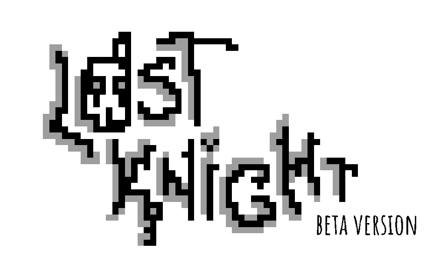
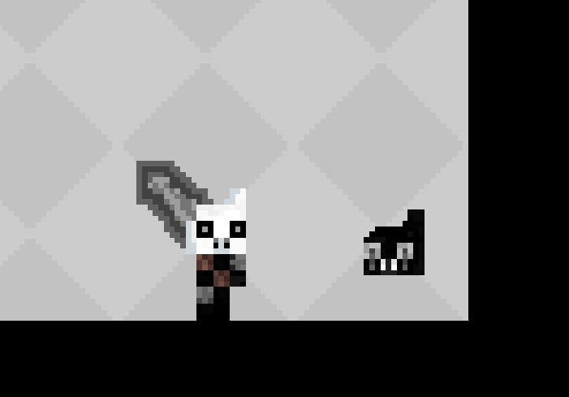
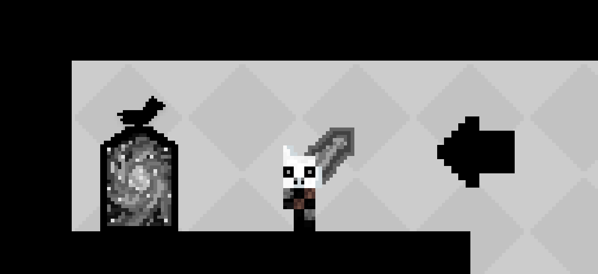
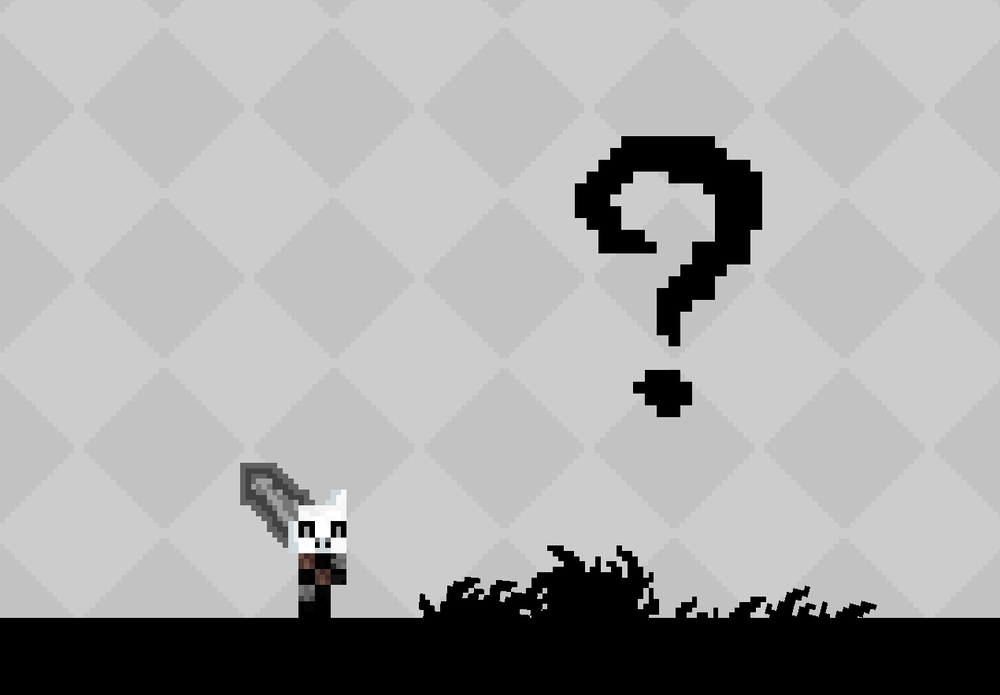
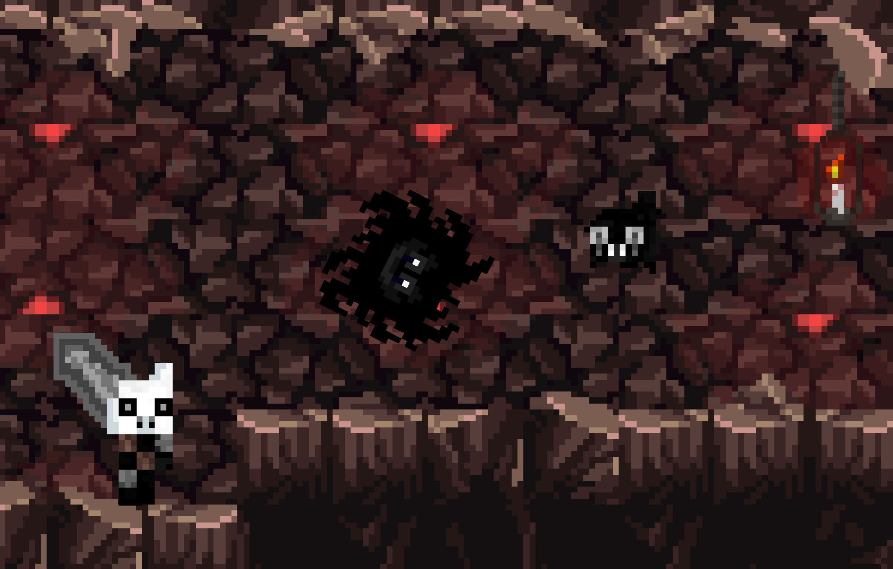
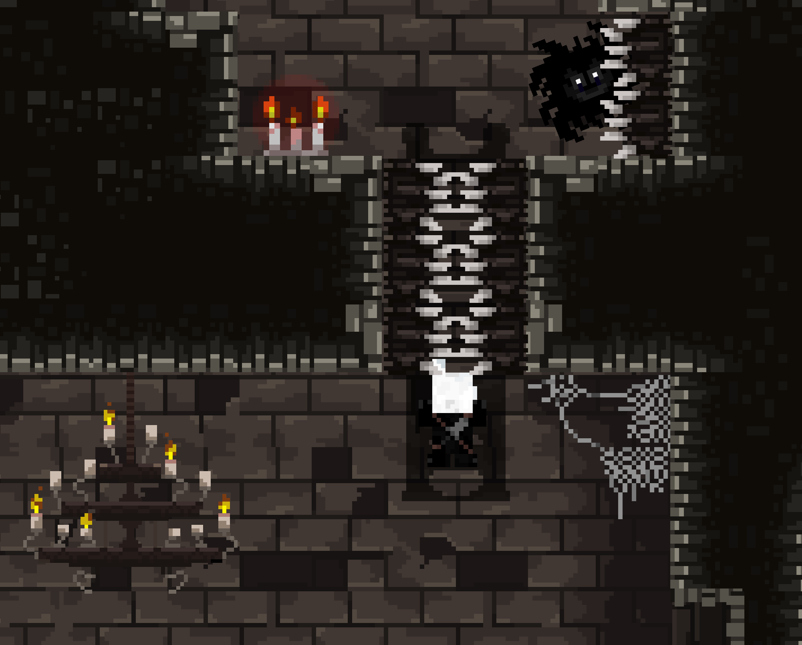

# Lost Knight

## Overview
**Lost Knight** is a challenging 2D platformer game developed from scratch as a solo project for my highschool atestate using **Unity**. Players embark on an adventurous journey through five intricately designed levels filled with obstacles, enemies, and hidden treasures.

## Features
- **Five Challenging Levels**: Each level is uniquely designed with a specific theme, soundtrack and platforming challanges to test player's skills and reflexes, each with 3 carefully placed secret Black Skulls.
  
  
  
- **Design And Animations**: Original character, obstacles and many other designs with detailed animations in order to enhance the gameplay experience.
  
 

- **Custom Scripts**: Scripts written to manage game mechanics, controls, and enemy behaviors.
  
 
 
- **Game Flow**: Simple Menu, 5 chained levels and a credit scene. Here are 2 images from levels 3 and 4, respectively.
  
  

## Installation
1. Clone the repository:
2. Run Lost Knight.exe

## Author's Note
  I have worked very hard on this game and I am very proud of how it came out. I have instilled my own personality through it's designs and also left an unspoken story behind it. Unfortunately, after building and delivering this project, some visual
  and also very particular mechanical bugs made it in. The sad part is all of the individual scripts, Unity project and indivual designs were lost and now only the build remains. However, I think it is a complete experience that contours my road as a developer. Fair warning: The game is very hard.

   
